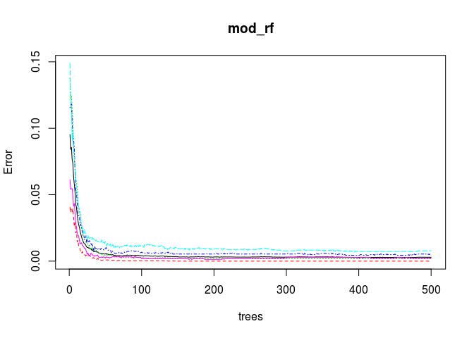
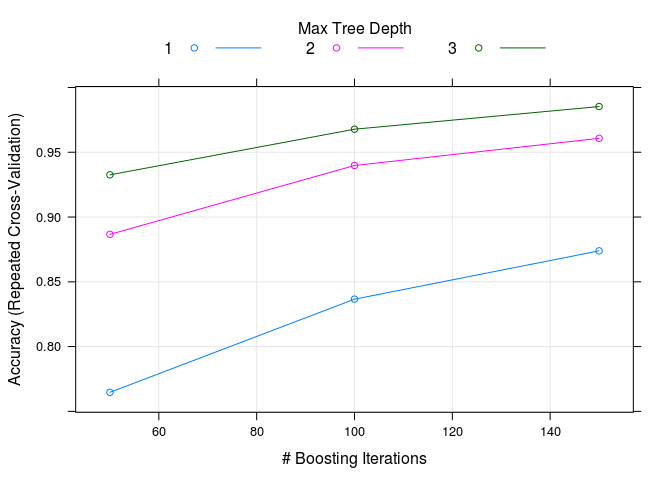
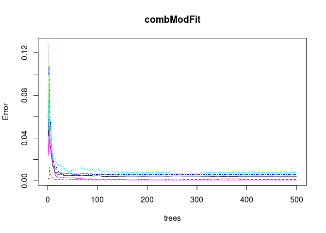

# R Notebook
RZ  

Import the data

```r
rm(list=ls())
# load data
training = read.csv("/home/runhua/Downloads/R_course/pml-training.csv")
testing = read.csv("/home/runhua/Downloads/R_course/pml-testing.csv")
```
Load library

```r
library(caret)
```

```
## Loading required package: lattice
```

```
## Loading required package: ggplot2
```

```r
library(rpart)
library(rpart.plot)
library(RColorBrewer)
library(randomForest)
```

```
## randomForest 4.6-12
```

```
## Type rfNews() to see new features/changes/bug fixes.
```

```
## 
## Attaching package: 'randomForest'
```

```
## The following object is masked from 'package:ggplot2':
## 
##     margin
```
Set seed

```r
set.seed(65536)
```

Train test validation split


```r
inTrain <- createDataPartition(training$classe, p=0.6, list=FALSE)
myTraining <- training[inTrain, ]
myTesting <- training[-inTrain, ]
dim(myTraining); dim(myTesting)
```

```
## [1] 11776   160
```

```
## [1] 7846  160
```
Remove zero variance information

```r
nzv <- nearZeroVar(myTraining)
myTraining <- myTraining[,-nzv]
myTesting <- myTesting[,-nzv]
testing <- testing[,-nzv]
```

Remove null over 95% 

```r
mostlyNA <- sapply(myTraining, function(x) mean(is.na(x))) > 0.95
myTraining <- myTraining[, mostlyNA==F]
myTesting <- myTesting[, mostlyNA==F]
testing <- testing[, mostlyNA==F]
dim(myTraining); dim(myTesting)
```

```
## [1] 11776    59
```

```
## [1] 7846   59
```
The data now has been reduced to 54 features where the majority are not nulls anymore.

Remove primary keys

```r
myTraining <- myTraining[, -(1:5)]
myTesting <- myTesting[, -(1:5)]
testing <- testing[,-(1:5)]
```

Train model

I use 5 fold cross validation for gradient boosting and lda models. The output are then used in the combined model.

```r
fitControl <- trainControl(method = "repeatedcv",number = 5,repeats = 1)
mod_rf <- randomForest(classe ~ ., data = myTraining)
mod_gbm <- train(classe ~ ., data = myTraining, method = "gbm",trControl = fitControl,verbose=FALSE)
```

```
## Loading required package: gbm
```

```
## Loading required package: survival
```

```
## 
## Attaching package: 'survival'
```

```
## The following object is masked from 'package:caret':
## 
##     cluster
```

```
## Loading required package: splines
```

```
## Loading required package: parallel
```

```
## Loaded gbm 2.1.1
```

```
## Loading required package: plyr
```

```r
mod_lda <- train(classe ~ ., data = myTraining, method = "lda",trControl = fitControl,verbose=FALSE)
```

```
## Loading required package: MASS
```

```r
pred_rf <- predict(mod_rf, myTesting)
pred_gbm <- predict(mod_gbm, myTesting)
pred_lda <- predict(mod_lda, myTesting)
predDF <- data.frame(pred_rf, pred_gbm, pred_lda, classe = myTesting$classe)
combModFit <- randomForest(classe ~ ., data = predDF)
combPred <- predict(combModFit, predDF)
```

Display the confusionMatrix

```r
confusionMatrix(pred_rf, myTesting$classe)
```

```
## Confusion Matrix and Statistics
## 
##           Reference
## Prediction    A    B    C    D    E
##          A 2230    8    0    0    0
##          B    2 1510    6    0    0
##          C    0    0 1361   14    0
##          D    0    0    1 1272    1
##          E    0    0    0    0 1441
## 
## Overall Statistics
##                                           
##                Accuracy : 0.9959          
##                  95% CI : (0.9942, 0.9972)
##     No Information Rate : 0.2845          
##     P-Value [Acc > NIR] : < 2.2e-16       
##                                           
##                   Kappa : 0.9948          
##  Mcnemar's Test P-Value : NA              
## 
## Statistics by Class:
## 
##                      Class: A Class: B Class: C Class: D Class: E
## Sensitivity            0.9991   0.9947   0.9949   0.9891   0.9993
## Specificity            0.9986   0.9987   0.9978   0.9997   1.0000
## Pos Pred Value         0.9964   0.9947   0.9898   0.9984   1.0000
## Neg Pred Value         0.9996   0.9987   0.9989   0.9979   0.9998
## Prevalence             0.2845   0.1935   0.1744   0.1639   0.1838
## Detection Rate         0.2842   0.1925   0.1735   0.1621   0.1837
## Detection Prevalence   0.2852   0.1935   0.1752   0.1624   0.1837
## Balanced Accuracy      0.9988   0.9967   0.9964   0.9944   0.9997
```

```r
confusionMatrix(pred_gbm, myTesting$classe)
```

```
## Confusion Matrix and Statistics
## 
##           Reference
## Prediction    A    B    C    D    E
##          A 2229   18    0    1    0
##          B    3 1484   15    6    3
##          C    0   16 1347   20    2
##          D    0    0    6 1259   11
##          E    0    0    0    0 1426
## 
## Overall Statistics
##                                           
##                Accuracy : 0.9871          
##                  95% CI : (0.9844, 0.9895)
##     No Information Rate : 0.2845          
##     P-Value [Acc > NIR] : < 2.2e-16       
##                                           
##                   Kappa : 0.9837          
##  Mcnemar's Test P-Value : NA              
## 
## Statistics by Class:
## 
##                      Class: A Class: B Class: C Class: D Class: E
## Sensitivity            0.9987   0.9776   0.9846   0.9790   0.9889
## Specificity            0.9966   0.9957   0.9941   0.9974   1.0000
## Pos Pred Value         0.9915   0.9821   0.9726   0.9867   1.0000
## Neg Pred Value         0.9995   0.9946   0.9967   0.9959   0.9975
## Prevalence             0.2845   0.1935   0.1744   0.1639   0.1838
## Detection Rate         0.2841   0.1891   0.1717   0.1605   0.1817
## Detection Prevalence   0.2865   0.1926   0.1765   0.1626   0.1817
## Balanced Accuracy      0.9976   0.9867   0.9894   0.9882   0.9945
```

```r
confusionMatrix(pred_lda, myTesting$classe)
```

```
## Confusion Matrix and Statistics
## 
##           Reference
## Prediction    A    B    C    D    E
##          A 1856  190  142   78   60
##          B   79 1028  134   55  213
##          C  143  184  922  176  121
##          D  146   54  133  941  138
##          E    8   62   37   36  910
## 
## Overall Statistics
##                                           
##                Accuracy : 0.721           
##                  95% CI : (0.7109, 0.7309)
##     No Information Rate : 0.2845          
##     P-Value [Acc > NIR] : < 2.2e-16       
##                                           
##                   Kappa : 0.6468          
##  Mcnemar's Test P-Value : < 2.2e-16       
## 
## Statistics by Class:
## 
##                      Class: A Class: B Class: C Class: D Class: E
## Sensitivity            0.8315   0.6772   0.6740   0.7317   0.6311
## Specificity            0.9163   0.9240   0.9037   0.9282   0.9777
## Pos Pred Value         0.7979   0.6812   0.5964   0.6664   0.8642
## Neg Pred Value         0.9319   0.9227   0.9292   0.9464   0.9217
## Prevalence             0.2845   0.1935   0.1744   0.1639   0.1838
## Detection Rate         0.2366   0.1310   0.1175   0.1199   0.1160
## Detection Prevalence   0.2965   0.1923   0.1970   0.1800   0.1342
## Balanced Accuracy      0.8739   0.8006   0.7888   0.8300   0.8044
```

```r
confusionMatrix(combPred, myTesting$classe)
```

```
## Confusion Matrix and Statistics
## 
##           Reference
## Prediction    A    B    C    D    E
##          A 2230    8    0    0    0
##          B    2 1510    6    0    0
##          C    0    0 1360    9    0
##          D    0    0    2 1277    1
##          E    0    0    0    0 1441
## 
## Overall Statistics
##                                           
##                Accuracy : 0.9964          
##                  95% CI : (0.9948, 0.9976)
##     No Information Rate : 0.2845          
##     P-Value [Acc > NIR] : < 2.2e-16       
##                                           
##                   Kappa : 0.9955          
##  Mcnemar's Test P-Value : NA              
## 
## Statistics by Class:
## 
##                      Class: A Class: B Class: C Class: D Class: E
## Sensitivity            0.9991   0.9947   0.9942   0.9930   0.9993
## Specificity            0.9986   0.9987   0.9986   0.9995   1.0000
## Pos Pred Value         0.9964   0.9947   0.9934   0.9977   1.0000
## Neg Pred Value         0.9996   0.9987   0.9988   0.9986   0.9998
## Prevalence             0.2845   0.1935   0.1744   0.1639   0.1838
## Detection Rate         0.2842   0.1925   0.1733   0.1628   0.1837
## Detection Prevalence   0.2852   0.1935   0.1745   0.1631   0.1837
## Balanced Accuracy      0.9988   0.9967   0.9964   0.9963   0.9997
```

From the confusion Matrix, the accuracy achieved 0.9964 (with the RF being 0.9959).

The ensembled model is slightly better than using RF alone.

Display the Random Forest Model results

```r
plot(mod_rf)
```

<!-- -->
Display the Boosted Regression Model results

```r
plot(mod_gbm)
```

<!-- -->
Display the Ensembled Model results

```r
plot(combModFit)
```

<!-- -->

This confirms with the Confusion Matrix results that the model is further enhanced (by a margin) by using ensemble model.

Print the final Prediction

```r
pred_rf <- predict(mod_rf, testing)
pred_gbm <- predict(mod_gbm, testing)
pred_lda <- predict(mod_lda, testing)
predDF <- data.frame(pred_rf, pred_gbm, pred_lda)
preds <- predict(combModFit, predDF)
```
Shows the final Prediction Results

```r
preds
```

```
##  1  2  3  4  5  6  7  8  9 10 11 12 13 14 15 16 17 18 19 20 
##  B  A  B  A  A  E  D  B  A  A  B  C  B  A  E  E  A  B  B  B 
## Levels: A B C D E
```


